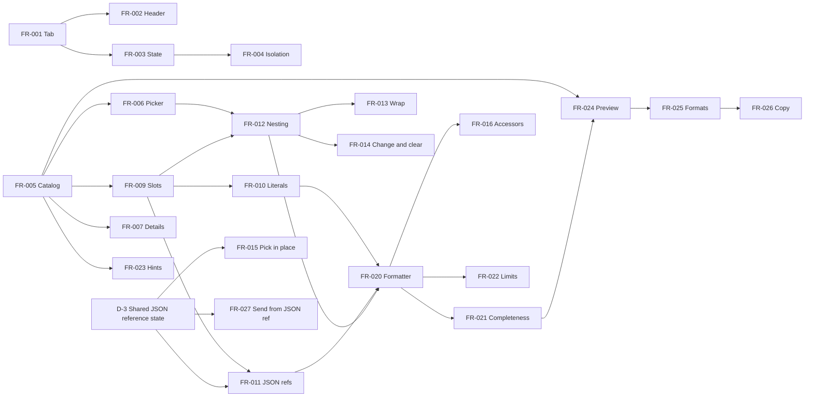

# Expression Functions Builder — Product Requirements Document (PRD)

> Version: v1.0 | Author: Ryan Rettinger | Date: 2026-09-27
> Status: Draft
> Builds: the Power Platform ToolBox (PPTB) tool (`apps/pptb`) and the static web build (`apps/web`). Both render the same shared shell (`packages/builder-ui/src/app/ExpressionBuilderShell.tsx`), so every requirement applies to both builds unless it says otherwise.
> Prior art: [JSON Reference Builder spec](../v2%20update/spec.md) (Approved 2026-09-26). This PRD reuses its ID style (FR, CON, SC), its MoSCoW discipline and its Given-When-Then scenarios.

## 1. Overview

### 1.1 Background and motivation

ExpressionBuilder has two builders today, chosen from header tabs (`BuilderView = 'condition' | 'jsonReference'`):

1. **Condition builder**: composes a boolean predicate for a trigger condition or Filter array.
2. **JSON reference builder**: the user pastes a flow-run output, selects a value and copies a correctly rooted reference, for example `outputs('Get_items')?['body']?['value'][0]?['Requester']?['Email']`.

A reference is usually only the start. Makers then need to transform the value: upper-case it, join it with another value, format a date, add days, fall back to a default. They do this by hand in the designer's expression editor, where the common mistakes are a misspelt or wrongly cased function name, arguments in the wrong order, a missing comma or parenthesis in a nested call, an unquoted or badly escaped string (`'O'Brien'` instead of `'O''Brien'`), a number typed as text, and confusion between the bare expression and the `@{…}` form used inside text.

The **Expression functions** builder is a third tab. The user starts from a value they selected in JSON reference, or from nothing. They then apply any function from the Microsoft Workflow Definition Language (WDL) [expression functions reference](https://learn.microsoft.com/azure/logic-apps/expression-functions-reference). Each argument can be a literal, a JSON reference or another function call, and calls can nest to any depth. The builder produces a correctly formatted, paste-ready expression. Like JSON reference, it runs locally, saves nothing and never touches the condition document.

### 1.2 Objectives

- **Business objective**: make ExpressionBuilder cover the full path from "where is my value" to "the expression I paste", which strengthens the PPTB listing and the static site without new infrastructure, dependencies or data handling.
- **User objective**: let a maker compose nested WDL expressions that are correct on the first paste, without memorising function names, argument order or quoting rules.
- **Success metrics**. The product has no telemetry and never will (CON-008), so every metric is measured in tests or in moderated sessions.
  - **North star**: in moderated sessions with at least 5 first-time makers, at least 4 produce and paste both headline examples (Appendix A cases 1 and 2) into a flow that saves and runs, each within 3 minutes, without help.
  - **Formatting correctness**: every normative case in Appendix A passes (SC-001), and every expression in the live-flow sample saves and returns its expected value (SC-008).
  - **Catalog coverage**: 100% of the functions listed on the reference page on the catalog date are available, with exact names (SC-006).
  - **No regressions**: Condition and JSON reference outputs, the saved-expression format and the existing e2e suites are unchanged (SC-003, SC-009).

### 1.3 Scope

**In scope for v1.0 (Must, 16 features)**: the third tab and its header; in-memory state; isolation from the other builders; a bundled, versioned offline catalog; a grouped function picker; argument slots from each signature (required, optional and repeating); literal, JSON reference and nested-function arguments; a pure engine formatter; completeness checks; a highlighted output preview; the two copy formats; copying through the platform adapter; and documentation and listing updates.

**Planned for v1.1 (Should, 6 features)**: function details; wrap in function; change function in place and clear; size and depth limits beyond the provisional constants; context hints; "Use in Expression functions" from JSON reference.

**Candidates for v2.0 (Could, 6 features)**: a Microsoft Learn link per function; picking a payload value in place; accessors on a function result; reorder, duplicate and move; undo and redo; starter recipes.

**Out of scope (Won't, this time)**:

| Item | Why it is deferred |
| --- | --- |
| Argument type validation (FR-029) | The reference's types are loose (`any`, "string or array"), and implicit conversion rules vary by function. A partial checker would give false confidence. v1 checks structure only. |
| Full-text function search, favourites, recents (FR-030) | The picker filters by name, which covers the core task. Favourites and recents need persistence, which CON-008 rules out. |
| Provider-specific function availability (FR-031) | No authoritative per-function availability table exists for Power Automate versus Logic Apps Consumption and Standard. The docs explain the gap instead. |
| Parsing an existing expression into the builder (FR-032) | Needs a WDL parser. The engine stays a formatter (CON-003), and no parser dependency is allowed (CON-001). |
| Inserting the result into the Condition builder, or a third `ExpressionMode` (FR-033) | See CON-004 and the trade-off in section 7.2. |
| Raw free-text expression arguments (FR-034) | Breaks the guarantee that the output is correctly formatted. |
| Saving, exporting or sharing a composition (FR-035) | State is ephemeral by requirement (CON-008). |

## 2. User personas

| Persona | Role | Core goal | Primary pain point |
| --- | --- | --- | --- |
| **Flow maker** (citizen developer) | Business user who builds cloud flows in the designer | Transform a value from a previous step without learning WDL syntax | Nested calls fail to save or return the wrong value because of quoting, commas, parentheses or casing |
| **Power Platform consultant** | Professional who builds many flows, often from PPTB | Produce complex nested expressions quickly and exactly | Hand-typing long expressions is slow, and one typo costs a save-run-debug cycle |
| **Keyboard and screen-reader maker** | Maker who uses only the keyboard, often with a screen reader | Complete the same task as everyone else without a mouse | Visual expression editors are often mouse-only and don't announce structure or errors |
| **Tool maintainer** | Owner of this repository | Ship and keep the feature correct as Microsoft changes the reference | Hand-maintained function lists drift, and UI changes risk regressions in existing builders |

## 3. User stories

All stories follow INVEST: each is independent of the others' implementation, leaves the "how" negotiable, has visible user value, is small enough for one iteration, and is testable through the acceptance criteria of its mapped features.

### 3.1 Flow maker

| ID | Story | Features |
| --- | --- | --- |
| US-A1 | **As a** flow maker, **I want to** apply a function such as `toUpper` to a value I selected in JSON reference, **so that** I get a paste-ready expression without learning the syntax. | FR-001, FR-006, FR-009, FR-011, FR-024 |
| US-A2 | **As a** flow maker, **I want to** type a text, number, true/false or empty value as an argument and choose which of these it is, **so that** it is quoted and escaped correctly every time. | FR-010, FR-020 |
| US-A3 | **As a** flow maker, **I want to** put one function inside another, such as `addDays(utcNow(), 7)`, **so that** I can build multi-step transformations in one expression. | FR-012, FR-013 |
| US-A4 | **As a** flow maker, **I want to** be told what is missing before I copy, **so that** I never paste an incomplete expression. | FR-021, FR-022 |
| US-A5 | **As a** flow maker, **I want to** see what a function does, its arguments and an example, **so that** I pick the right function and fill its arguments in the right order. | FR-007, FR-008, FR-023 |

### 3.2 Power Platform consultant

| ID | Story | Features |
| --- | --- | --- |
| US-B1 | **As a** consultant, **I want to** combine several values from the same payload in one expression, such as joining first and last names, **so that** I don't have to assemble references by hand. | FR-009, FR-011, FR-015 |
| US-B2 | **As a** consultant, **I want to** choose between the bare form and the `@{…}` form when copying, **so that** the result fits either the expression editor or a text field. | FR-025 |
| US-B3 | **As a** consultant using PPTB, **I want** Copy to report honestly whether the text reached the clipboard, **so that** I never paste stale content. | FR-026 |
| US-B4 | **As a** consultant, **I want to** rework an expression quickly (wrap it, change a function, reorder arguments, undo), **so that** iterating doesn't mean starting over. | FR-013, FR-014, FR-017, FR-018 |
| US-B5 | **As a** consultant, **I want to** read a property or item from a function's result, such as `split(x, ',')[0]`, **so that** common patterns need no manual editing. | FR-016 |

### 3.3 Keyboard and screen-reader maker

| ID | Story | Features |
| --- | --- | --- |
| US-C1 | **As a** keyboard user, **I want to** reach the Expression functions tab and return to the other builders with the keyboard alone, **so that** I can use every builder. | FR-001, NFR-004 |
| US-C2 | **As a** screen-reader user, **I want to** find and choose a function from a list that announces its name and group as I move, **so that** I can pick functions without seeing the list. | FR-006, NFR-004 |
| US-C3 | **As a** screen-reader user, **I want to** move through the expression's arguments and hear each argument's name, whether it is required and its current value, **so that** I understand the structure I am building. | FR-009, NFR-004 |
| US-C4 | **As a** screen-reader user, **I want** completeness problems and copy results to be announced, **so that** I know whether the expression is ready and copied. | FR-021, FR-026 |

### 3.4 Tool maintainer

| ID | Story | Features |
| --- | --- | --- |
| US-D1 | **As the** maintainer, **I want** the catalog to be generated or checked against the Microsoft reference by a repeatable, reviewable process, **so that** updates are a data change with a visible diff. | FR-005 |
| US-D2 | **As the** maintainer, **I want** formatting to be a pure engine function with normative test cases, **so that** correctness is proven in unit tests, not in the UI. | FR-020 |
| US-D3 | **As the** maintainer, **I want** proof that the new builder changes nothing in the Condition builder, JSON reference or the saved format, **so that** existing users are safe. | FR-004, CON-002, CON-003 |
| US-D4 | **As the** maintainer, **I want** the docs, changelogs and PPTB listing updated in the same change, **so that** users can discover and understand the feature. | FR-028 |

### 3.5 Story map

The journey runs left to right. The first row is the walking skeleton (all Must) and forms the critical path. Later rows are releases.

| | Discover | Start | Compose | Check | Copy and paste |
| --- | --- | --- | --- | --- | --- |
| **v1.0 (Must)** | FR-001 tab, FR-002 header | FR-005 catalog, FR-006 picker | FR-009 slots, FR-010 literals, FR-011 JSON references, FR-012 nesting | FR-020 formatter, FR-021 completeness | FR-024 preview, FR-025 formats, FR-026 copy |
| **v1.1 (Should)** | FR-027 send from JSON reference | FR-007 details | FR-013 wrap, FR-014 change and clear | FR-022 limits, FR-023 hints | |
| **v2.0 (Could)** | FR-008 Learn link | FR-019 recipes | FR-015 pick in place, FR-016 accessors, FR-017 reorder, FR-018 undo | | |

FR-003, FR-004 and FR-028 cut across every step.

## 4. Functional requirements

### 4.1 Feature list

| ID | Feature | Stories | Description | Input / output / interaction |
| --- | --- | --- | --- | --- |
| **Builder switching and isolation** | | | | |
| FR-001 | Third builder tab | US-A1, US-C1 | Adds an **Expression functions** tab after **JSON reference** in the existing tablist. | In: activation by pointer or keyboard. Out: the Expression functions panel. The existing WAI-ARIA tabs contract (spec v2 FR-004) extends to three tabs. |
| FR-002 | Header in the Expression functions view | US-A1 | The header hides the mode switch, Import and Export, and shows the privacy sentence, as JSON reference does. | Out: header controls per view. Stays one row above 900px (v2 FR-007). |
| FR-003 | State lifetime | US-B4 | The composition, copy format and focused argument stay in memory while the user switches tabs. A reload clears them. | No reads or writes to storage. |
| FR-004 | Isolation from other builders | US-D3 | Using the builder never changes the condition document, mode, fields, source, predicate, diagnostics or Export output, and never changes JSON reference state. | Reads the JSON reference selection only when the user inserts it. |
| **Function catalog** | | | | |
| FR-005 | Bundled, versioned catalog | US-D1 | Every function in the reference, with name, group, short description, ordered arguments (name, type label, required, optional or repeating, with a minimum count) and an example. Ships in the bundle; never fetched. | Data module with `catalogVersion`, `sourceUrl` and `sourceDate`. |
| FR-006 | Grouped function picker | US-A1, US-C2 | A WAI-ARIA combobox listing functions by group, filtered by name as the user types. | In: typed text, arrow keys, Enter. Out: the chosen function is placed in the target slot or as the root. |
| FR-007 | Function details | US-A5 | Shows the chosen or highlighted function's description, signature, arguments and example. | Out: read-only panel. |
| FR-008 | Microsoft Learn link | US-A5 | Each function shows a link to its section of the reference. | Opens only on a user action. PPTB route to be confirmed (Q-8). |
| **Expression composition** | | | | |
| FR-009 | Argument slots | US-A1, US-B1, US-C3 | Each call shows one slot per argument in signature order. Optional slots can be left empty. Repeating arguments (as in `concat`) can be added and removed down to their minimum. | Out: labelled slots with required or optional state. |
| FR-010 | Literal arguments | US-A2 | A slot can hold a text, number, true, false or null literal. The user chooses the kind; the builder never infers it. | In: kind and value. Out: a formatted literal (section 4.4). |
| FR-011 | JSON reference arguments | US-A1, US-B1 | A slot can hold the reference currently selected in JSON reference, inserted as a snapshot. | In: "Insert JSON reference". Out: a reference chip. Disabled, with a reason, when JSON reference has nothing to copy. |
| FR-012 | Nested function arguments | US-A3 | A slot can hold another function call, chosen with the picker, with its own slots, to any depth within FR-022's limits. | Out: a nested call. |
| FR-013 | Wrap in function | US-A3, US-B4 | Wraps the root or any nested value in a new function. The wrapped value becomes that function's first argument. | In: "Wrap in function…" and the picker. |
| FR-014 | Change function and clear | US-B4 | Replaces a call's function in place, keeping argument values by position where the new signature has slots for them. Clears the whole composition after a confirmation. | Values that no longer fit are listed in the confirmation before they are dropped. |
| FR-015 | Pick from payload in place | US-B1 | Selects a value from the last parsed JSON reference sample in a popover, without switching tabs. | Reuses the payload tree's keyboard contract (v2 FR-036). |
| FR-016 | Accessors on a function result | US-B5 | Adds `?['key']` or `[n]` accessors after a call's closing parenthesis. | Same escaping as v2 FR-040. |
| FR-017 | Reorder, duplicate and move | US-B4 | Reorders repeating arguments, duplicates a subtree, or moves a subtree to another empty slot. | Keyboard-operable; no drag-only paths. |
| FR-018 | Undo and redo | US-B4 | Steps back and forward through composition changes in memory. | Ctrl+Z, Ctrl+Y and buttons. History is cleared on reload. |
| FR-019 | Starter recipes | US-A5 | Inserts common patterns with empty slots, such as "Default if empty" (`coalesce`) or "Format a date" (`formatDateTime`). | Recipes are catalog data, not code. |
| **Formatting and checks** | | | | |
| FR-020 | Pure expression formatter | US-A2, US-D2 | An engine function that turns a composition into bare expression text by the rules in section 4.4. | In: a composition tree. Out: text, or a list of problems. Deterministic, no I/O. |
| FR-021 | Completeness checks | US-A4, US-C4 | Blocks Copy and lists every problem: an empty required slot, a gap before a filled optional slot, too few repeating arguments, an invalid number, a line break in text. | Out: a problem list linked to slots. |
| FR-022 | Size and depth limits | US-A4 | Caps nesting depth and total node count with named constants. | Provisional: depth 12 (the engine's `DEFAULT_MAX_DEPTH`) and 200 nodes. |
| FR-023 | Context hints | US-A5 | Shows non-blocking notes for functions that only work in some contexts: `item`, `items` and `iterationIndexes` in loops; `body`, `outputs`, `actions` and `result` needing an existing action name; `trigger*` needing a trigger. | Out: notes; never blocks Copy. |
| **Output and copy** | | | | |
| FR-024 | Output preview | US-A1 | Shows the formatted expression with syntax colouring, using the existing `ExpressionPreview` tokenizer extended to every catalog function name. | The displayed text equals what Copy writes. |
| FR-025 | Copy formats | US-B2 | Expression editor (bare, the default) or Inside text `@{…}`. | Same choices, labels and idle texts as v2 FR-050. |
| FR-026 | Copy through the platform adapter | US-B3, US-C4 | Writes through `PlatformAdapter.copyToClipboard` only, and reports success only when the host accepted the text. | Same status model as v2 FR-053 and FR-054. |
| **JSON reference integration** | | | | |
| FR-027 | Use in Expression functions | US-A1 | A button on JSON reference's Reference card opens the Expression functions tab with the current reference in the focused slot, or as the root if the composition is empty. | Doesn't change JSON reference state. |
| **Documentation** | | | | |
| FR-028 | Documentation and listing | US-D4 | Updates the READMEs, user manual, PPTB usage guide, both changelogs, and the PPTB manifest's description and keywords. | See AC-FR028. |
| **Won't have (this time)** | | | | |
| FR-029 | Argument type validation | — | Checking argument types against the signature. | Deferred; see section 1.3. |
| FR-030 | Full-text search, favourites, recents | — | Searching descriptions and examples; remembered functions. | Deferred. |
| FR-031 | Provider-specific availability | — | Hiding or badging functions by host (Power Automate, Logic Apps Consumption or Standard). | Deferred. |
| FR-032 | Parse an existing expression | — | Pasting WDL text to edit it in the builder. | Deferred. |
| FR-033 | Condition builder insertion or a third `ExpressionMode` | — | Using a composition as a Condition operand, or as a saved mode. | Deferred; see CON-004. |
| FR-034 | Raw expression arguments | — | Free-text arguments that bypass the formatter. | Deferred. |
| FR-035 | Save, export or share | — | Persisting or serialising compositions. | Deferred. |

### 4.2 Non-functional requirements

| ID | Dimension | Requirement |
| --- | --- | --- |
| NFR-001 | Performance | At the FR-022 limits, the preview and the problem list update within 50 ms of an edit. The picker filters the full catalog within 100 ms of a keystroke. Switching to the tab responds within 100 ms. Measured in Edge and the PPTB desktop app on a typical developer laptop. |
| NFR-002 | Privacy | Opening the tab, composing, inserting references and copying make no network requests, send no telemetry, log no composition or payload content, and write nothing to host settings, localStorage, sessionStorage, IndexedDB or cookies. The clipboard is written only on Copy. Text inputs turn off spell checking, autocorrect, automatic capitalisation and autocomplete (v2 FR-062). |
| NFR-003 | Security | Catalog text, literals and references are rendered only as text, never as HTML. Nothing is evaluated. The PPTB manifest keeps declaring no `cspExceptions`. |
| NFR-004 | Accessibility | The tablist follows the WAI-ARIA tabs pattern with three tabs. The picker follows the WAI-ARIA combobox pattern with a listbox popup and group labels. The composition is navigable as a tree (or a structure the plan justifies), and each slot announces its function, argument name, required or optional state and value. Every action works from the keyboard with a visible focus ring. Problems are announced as alerts, statuses politely. An axe scan of all three builder views in the light and dark themes reports no serious or critical violations. Motion follows the reduced-motion setting. |
| NFR-005 | Compatibility | Behaves the same in the PPTB desktop app, the PPTB VS Code extension (checking it is recommended) and current Chromium browsers for the static site. `minAPI` stays 1.0.17. |
| NFR-006 | Bundle size | The increase is measured and reported for both builds. Over 30 kB gzipped in either build, including the catalog, needs a written justification. The PPTB build stays a single self-contained script with no separately loaded chunks, workers or data files. |
| NFR-007 | Determinism | The formatter's output depends only on its input. The same composition always yields the same text, in every build and on every run. |
| NFR-008 | Maintainability | Adding, renaming or changing a function is a catalog data change with no UI or formatter code change, and it shows as a reviewable diff. |
| NFR-009 | Layout | At 375×667, 768×1024, 900×700, 1280×420, 1280×800 and 1440×900, in all three views and both themes, the page doesn't scroll sideways, no control is cut off, and the whole tab strip fits. At 1280×800, the preview and Copy are visible without scrolling the page. |
| NFR-010 | Theming | Uses the Graphite tokens and `eb-*` classes, has no hard-coded colours, and follows the host theme (PPTB) or the operating system's colour scheme (static site). |
| NFR-011 | Localisation | English only, as in the rest of the app. User-facing strings are kept together so they could be translated later. |

Availability, disaster recovery and backup don't apply: both builds are static bundles with no server.

### 4.3 Feature dependencies

Build order for the Must chain: FR-005 and FR-020 in parallel (data and engine, no UI) → FR-001 to FR-004 (tab and shell plumbing, including D-3) → FR-006 and FR-009 → FR-010, FR-011 and FR-012 → FR-021 → FR-024, FR-025 and FR-026 → FR-028. Every Must depends only on other Musts and on D-3.

### 4.4 Formatting rules (normative for FR-020)

1. **Function names** come only from the catalog and are written exactly as the catalog spells them, case included. The user can't type a free function name.
2. **Calls** are written `name(arg1, arg2)`: no space before `(`, one comma and one space between arguments, and no spaces inside the parentheses. A call with no arguments is `name()`. This matches the engine's existing join (`formatter.ts:160`) and Microsoft's examples.
3. **Optional arguments**: trailing empty optional slots are omitted with their commas. An empty optional slot followed by a filled one is a completeness problem (FR-021). The formatter never invents a default value.
4. **Repeating arguments** appear in slot order. Fewer than the catalog's minimum is a completeness problem.
5. **Text literals** are wrapped in single quotes, with each `'` doubled. No other character is escaped or changed: backslashes, `@`, `{`, `}` and Unicode are kept. The empty text is `''`. A line break in text is a completeness problem in v1 (Q-7).
6. **Number literals** must match `-?(0|[1-9][0-9]*)(\.[0-9]+)?` after leading and trailing whitespace is trimmed, and are written exactly as entered, so large integers and decimals are never rounded. `NaN`, `Infinity`, exponents, a leading `+`, `.5`, `5.` and leading zeros are problems.
7. **Booleans and null** are written `true`, `false` and `null`.
8. **JSON references** are written exactly as `formatPayloadReference` returns them for the stored root and path.
9. **Nested calls** are formatted the same way, in place. No extra parentheses are added.
10. **Accessors** on a call's result (FR-016, Could) follow v2 FR-040: `?['key']` with apostrophes doubled, and `[n]` for an index.
11. **Output** is one line with no leading `@`. The Inside text format is `@{` + output + `}`.

## 5. Prioritisation

### 5.1 MoSCoW matrix

| ID | Feature | Priority | Rationale |
| --- | --- | --- | --- |
| FR-001 | Third builder tab | Must | Without it, the feature can't be reached. |
| FR-002 | Header in the Expression functions view | Must | The Condition controls would act on a document that isn't visible. |
| FR-003 | State lifetime | Must | Switching to JSON reference to get a second value would otherwise lose the composition. |
| FR-004 | Isolation from other builders | Must | Protects existing users' output (US-D3). |
| FR-005 | Bundled, versioned catalog | Must | "Any function" and "exact names" depend on it, and it must work offline. |
| FR-006 | Grouped function picker | Must | The only way to choose a function. |
| FR-007 | Function details | Should | Slot labels carry the argument names; details help but have a workaround (the docs). |
| FR-008 | Microsoft Learn link | Could | The user can search Learn themselves. |
| FR-009 | Argument slots | Must | The core composition model. |
| FR-010 | Literal arguments | Must | Most functions need a literal (`addDays(…, 7)`). |
| FR-011 | JSON reference arguments | Must | The feature's stated purpose. |
| FR-012 | Nested function arguments | Must | The "stacking" requirement. |
| FR-013 | Wrap in function | Should | Building top-down works without it. |
| FR-014 | Change function and clear | Should | Workaround: empty the slot and pick again. |
| FR-015 | Pick from payload in place | Could | Workaround: switch tabs and insert. |
| FR-016 | Accessors on a function result | Could | Workaround: edit the text after pasting. |
| FR-017 | Reorder, duplicate and move | Could | Workaround: re-enter arguments. |
| FR-018 | Undo and redo | Could | Compositions are short. |
| FR-019 | Starter recipes | Could | Nice for onboarding, not required. |
| FR-020 | Pure expression formatter | Must | Correct output is the product. |
| FR-021 | Completeness checks | Must | Otherwise Copy can produce broken expressions. |
| FR-022 | Size and depth limits | Should | The Must formatter already refuses depth beyond a constant; tuning and messages can follow. |
| FR-023 | Context hints | Should | Prevents a class of runtime errors, but doesn't block the task. |
| FR-024 | Output preview | Must | Users must see what they copy. |
| FR-025 | Copy formats | Must | Both paste targets are common (v2 reconciliation row 6). |
| FR-026 | Copy through the platform adapter | Must | CON-006 and truthful status. |
| FR-027 | Use in Expression functions | Should | Workaround: switch tabs and insert. |
| FR-028 | Documentation and listing | Must | Owner requirement, as in v2. |
| FR-029 | Argument type validation | Won't | See section 1.3. |
| FR-030 | Full-text search, favourites, recents | Won't | See section 1.3. |
| FR-031 | Provider-specific availability | Won't | See section 1.3. |
| FR-032 | Parse an existing expression | Won't | See section 1.3. |
| FR-033 | Condition builder insertion or a third `ExpressionMode` | Won't | See CON-004. |
| FR-034 | Raw expression arguments | Won't | See section 1.3. |
| FR-035 | Save, export or share | Won't | See section 1.3. |

**Validation**: 35 features. Must 16 (46%), Should 6 (17%), Could 6 (17%), Won't 7 (20%). Must is under 60%. Won't has more than two items. Every Must depends only on other Musts and on D-3 (section 4.3).

### 5.2 Release planning

- **v1.0 (MVP)**: all Must features, NFR-001 to NFR-011, and SC-001 to SC-011.
- **v1.1**: all Should features.
- **v2.0**: evaluate the Could features and revisit FR-029 and FR-031 against the live-flow results.

## 6. Acceptance criteria

Unless a criterion says otherwise, each applies to both builds. "The preview" means the FR-024 output in the Expression editor format.

### FR-001 Third builder tab

**AC-FR001-01: Tab order and activation.** **Given** either build has loaded, **when** the user looks at the header, **then** the tablist labelled "Builders" shows "Condition builder", "JSON reference" and "Expression functions", in that order, and "Condition builder" is selected.
**AC-FR001-02: Keyboard wrap-around.** **Given** focus is on "Expression functions", **when** the user presses →, **then** "Condition builder" is selected and focused. **When** the user presses End from "Condition builder", **then** "Expression functions" is selected.
**AC-FR001-03: One panel exposed.** **Given** "Expression functions" is selected, **then** only its panel is visible and exposed to assistive technology, exactly one main landmark exists, and only the selected tab is in the Tab order.
**AC-FR001-04: Narrowest viewport.** **Given** a 375×667 viewport, **then** all three tabs fit within the header with no horizontal page scroll. If a visible label is shortened, each tab's accessible name still reads in full.

### FR-002 Header in the Expression functions view

**AC-FR002-01: Controls hidden.** **Given** "Expression functions" is selected, **then** the mode switch, Import and Export are hidden and the privacy sentence is shown.
**AC-FR002-02: Controls restored.** **Given** the user returns to "Condition builder", **then** the header matches its current Condition layout exactly.
**AC-FR002-03: Header height.** **Given** a viewport width from 901px to 1,440px, **then** the header stays on one row and is no taller in the Expression functions view than in the Condition view.

### FR-003 State lifetime

**AC-FR003-01: Survives switching.** **Given** a composition `toUpper(<JSON reference>)` and the Inside text format, **when** the user switches to "Condition builder" and back, **then** the composition, format and preview are unchanged.
**AC-FR003-02: Cleared on reload.** **Given** any composition, **when** the page or tool reloads, **then** the app opens on "Condition builder", and "Expression functions" is empty with the format set to Expression editor.
**AC-FR003-03: No storage.** **Given** a browser with the onboarding dialog already dismissed, **when** the user composes, switches tabs and copies, **then** zero writes are made to localStorage, sessionStorage, IndexedDB, cookies or host settings.

### FR-004 Isolation from other builders

**AC-FR004-01: Condition unchanged.** **Given** a document with rules, **when** the user composes an expression, inserts a JSON reference, copies, and switches back, **then** the document, mode, fields, source, predicate, diagnostics and Export JSON are byte-identical to before.
**AC-FR004-02: JSON reference unchanged.** **Given** a parsed sample with a selection, **when** the user inserts that reference into a slot, **then** JSON reference's sample, source, selection, expansion, copy format and copy status are unchanged.
**AC-FR004-03: Snapshot independence.** **Given** a slot holding `body('Get_items')?['value']`, **when** the user changes JSON reference's action name to "List rows", **then** the slot still holds `body('Get_items')?['value']`.

### FR-005 Bundled, versioned catalog

**AC-FR005-01: Coverage.** **Given** the catalog snapshot checked in with the catalog (source URL and date), **when** the catalog test runs, **then** every function in the snapshot is present exactly once, with identical name casing and group.
**AC-FR005-02: Offline.** **Given** the network is blocked, **when** the user opens the tab and the picker, **then** every function is listed, and no request is attempted.
**AC-FR005-03: Entry completeness.** **Given** any catalog entry, **then** it has a name, a group, a description of at most 200 characters, an example, and an argument list in which each argument has a name, a type label and a kind (required, optional or repeating). Optional arguments come only after required ones, and a repeating argument has a minimum count of at least 0.
**AC-FR005-04: Version shown.** **Given** the docs or an "About the catalog" note in the tab, **then** the catalog version and source date are visible.

### FR-006 Grouped function picker

**AC-FR006-01: Filter by name.** **Given** the picker is open, **when** the user types `adddays`, **then** the list shows `addDays` under "Date and time" and nothing that doesn't contain that text in its name. Matching ignores case.
**AC-FR006-02: No match.** **Given** the user types `xyz`, **then** the list shows "No functions match" and Enter does nothing.
**AC-FR006-03: Keyboard selection.** **Given** the picker has focus, **when** the user presses ↓ twice and Enter, **then** the second listed function is placed in the target slot and focus moves to its first slot (or to the call, if it has no arguments).
**AC-FR006-04: Escape.** **Given** the popup is open, **when** the user presses Escape, **then** the popup closes, the slot is unchanged and focus returns to the combobox.
**AC-FR006-05: Groups.** **Given** an empty filter, **then** functions are grouped by catalog group, groups follow the reference's order, and each group has an accessible label.

### FR-007 Function details

**AC-FR007-01: Shown for the highlighted function.** **Given** the picker highlights `formatDateTime`, **then** the details show its description, signature (with optional arguments marked), argument list and example.
**AC-FR007-02: Not HTML.** **Given** a catalog description containing `<b>`, **then** the details show the characters `<b>` as text.

### FR-008 Microsoft Learn link

**AC-FR008-01: Opens on request.** **Given** the details for `concat`, **when** the user activates "Microsoft Learn", **then** the host opens the reference at the `concat` section. No request is made before the user activates the link.

### FR-009 Argument slots

**AC-FR009-01: Required slots.** **Given** the user picks `substring` as the root, **then** three slots appear in order, labelled with its argument names from the catalog, the first two required and the third optional.
**AC-FR009-02: Repeating arguments.** **Given** `concat` with its minimum of 2 slots, **when** the user selects "Add argument" twice, **then** there are 4 slots. **When** the user removes one, **then** there are 3. The remove action is unavailable at the minimum.
**AC-FR009-03: No-argument function.** **Given** the user picks `utcNow`, whose only argument is optional, **then** one empty optional slot shows and the preview reads `utcNow()`.
**AC-FR009-04: Announced structure.** **Given** focus on the second slot of `addDays`, **then** a screen reader hears the function name, the argument name, "required" and the current value, or "empty".

### FR-010 Literal arguments

**AC-FR010-01: Text with an apostrophe.** **Given** a Text slot, **when** the user enters `O'Brien`, **then** the argument reads `'O''Brien'`.
**AC-FR010-02: Kind is explicit.** **Given** the value `5` entered as Text, **then** the argument reads `'5'`. **Given** `5` entered as Number, **then** it reads `5`.
**AC-FR010-03: Invalid numbers.** **Given** a Number slot, **when** the user enters `1e5`, `+3`, `.5`, `007` or `abc`, **then** the slot is marked invalid with "Enter a number such as 7, -5 or 0.25", and Copy is disabled.
**AC-FR010-04: Boundaries.** **Given** the Number `9007199254740993`, **then** it is written as `9007199254740993`. **Given** an empty Text value, **then** it is written as `''`. **Given** true, false or null, **then** they are written as `true`, `false` and `null`.

### FR-011 JSON reference arguments

**AC-FR011-01: Insert.** **Given** JSON reference has fixture A1 parsed (v2 Appendix A), Action, `Get items`, Full output, and `Email` selected, **when** the user selects "Insert JSON reference" in an empty slot, **then** the slot holds `outputs('Get_items')?['body']?['value'][0]?['Requester']?['Email']`.
**AC-FR011-02: Nothing to insert.** **Given** JSON reference was never opened, or has no parsed sample, or has a missing action name, **then** "Insert JSON reference" is disabled and its description reads "Open JSON reference, parse a sample and select a value first." (or "Enter an action name in JSON reference first.").
**AC-FR011-03: Two values from one sample.** **Given** `concat` with three slots, **when** the user inserts `triggerBody()?['first']`, enters Text `' '`, then selects `last` in JSON reference and inserts it, **then** the preview reads `concat(triggerBody()?['first'], ' ', triggerBody()?['last'])`.
**AC-FR011-04: Root only.** **Given** JSON reference with the root row selected and Trigger, Body only, **when** inserted, **then** the slot holds `triggerBody()`.

### FR-012 Nested function arguments

**AC-FR012-01: Headline nesting.** **Given** the root `addDays`, **when** the user fills its first slot with the function `utcNow` and its second with the Number `7`, **then** the preview reads `addDays(utcNow(), 7)`.
**AC-FR012-02: Three levels.** **Given** Appendix A case 1 built top-down, **then** the preview reads exactly `toUpper(concat(triggerBody()?['first'], ' ', triggerBody()?['last']))`.
**AC-FR012-03: Incomplete nested call.** **Given** `toUpper(concat(<empty>, <empty>))`, **then** Copy is disabled and the problem list names both empty `concat` slots.
**AC-FR012-04: Depth limit.** **Given** a composition at the maximum depth, **then** "Function" is unavailable in its deepest slots, with the reason "Maximum nesting depth reached".

### FR-013 Wrap in function

**AC-FR013-01: Wrap the root.** **Given** the root is a JSON reference `body('Get_item')?['Title']`, **when** the user wraps it in `toUpper`, **then** the preview reads `toUpper(body('Get_item')?['Title'])`.
**AC-FR013-02: Wrapper without arguments.** **Given** the user tries to wrap a value in `utcNow`, which has no required argument that can hold it, **then** the function isn't offered for wrapping.

### FR-014 Change function and clear

**AC-FR014-01: Values kept by position.** **Given** `toUpper(<ref>)`, **when** the user changes the function to `toLower`, **then** the preview reads `toLower(<ref>)`.
**AC-FR014-02: Values dropped.** **Given** `substring(<ref>, 0, 5)`, **when** the user changes to `trim`, **then** a confirmation lists the second and third values as removed. Cancelling leaves the composition unchanged. Confirming gives `trim(<ref>)`.
**AC-FR014-03: Clear.** **Given** any composition, **when** the user confirms Clear, **then** the composition is empty. The copy format and JSON reference state are unchanged.

### FR-015 Pick from payload in place

**AC-FR015-01: Pick without switching.** **Given** a parsed sample in JSON reference, **when** the user opens "Pick from payload" on a slot and selects `Requester › Email`, **then** the slot holds that reference, and JSON reference's own selection is unchanged.

### FR-016 Accessors on a function result

**AC-FR016-01: Index and key.** **Given** `split(<ref>, ',')`, **when** the user adds the index accessor `0`, **then** the preview reads `split(<ref>, ',')[0]`. **Given** `first(body('Get_items')?['value'])` with the key accessor `O'Brien`, **then** the preview ends `)?['O''Brien']`.

### FR-017 Reorder, duplicate and move

**AC-FR017-01: Reorder by keyboard.** **Given** `concat('a', 'b', 'c')`, **when** the user moves `'c'` up twice using keyboard commands, **then** the preview reads `concat('c', 'a', 'b')`.

### FR-018 Undo and redo

**AC-FR018-01: Undo a change.** **Given** the user changed a literal from `7` to `14`, **when** the user presses Ctrl+Z, **then** it reads `7`, and Ctrl+Y restores `14`. After a reload, nothing can be undone.

### FR-019 Starter recipes

**AC-FR019-01: Insert a recipe.** **Given** an empty composition, **when** the user inserts "Default if empty", **then** the composition is `coalesce(<empty>, <empty>)` and focus is on the first slot.

### FR-020 Pure expression formatter

**AC-FR020-01: Normative cases.** **Given** each composition in Appendix A, **when** the formatter runs, **then** the output equals the expected text character for character, and "problem" cases return the listed problems and no text.
**AC-FR020-02: Determinism.** **Given** the same composition, **when** it is formatted 1,000 times, **then** every output is identical.
**AC-FR020-03: Existing output unchanged.** **Given** the existing engine test suites, **then** `formatExpression`, `formatFieldReference` and `formatPayloadReference` pass unchanged, and `ExpressionNode` and `ExpressionMode` are not widened.
**AC-FR020-04: No I/O.** **Given** the engine package, **then** the formatter imports nothing from the UI, the platform adapter, the DOM or any network or storage API.

### FR-021 Completeness checks

**AC-FR021-01: Empty required slot.** **Given** `addDays(utcNow(), <empty>)`, **then** Copy is disabled, the preview area shows "Fill every required argument to build the expression", and the problem list reads "addDays: days is required", linking to the slot.
**AC-FR021-02: Optional gap.** **Given** `parseDateTime(<ref>, <empty locale>, 'dd/MM/yyyy')`, **then** the problem reads "parseDateTime: fill locale, or clear format". Clearing the format makes the expression `parseDateTime(<ref>)` and enables Copy.
**AC-FR021-03: Line break in text.** **Given** a Text value pasted with a line break, **then** the slot shows "Line breaks aren't supported in text values yet." and Copy is disabled.
**AC-FR021-04: Announcement.** **Given** the last problem is fixed, **then** the status "Expression ready" is announced politely. **Given** a new problem appears after an edit, **then** it is announced.

### FR-022 Size and depth limits

**AC-FR022-01: Node limit.** **Given** a composition with 200 nodes, **when** the user tries to add another argument or function, **then** the action is unavailable with "This expression has reached the 200-part limit."
**AC-FR022-02: Constants.** **Given** the source, **then** the depth and node limits are named constants, and their messages are built from those constants.

### FR-023 Context hints

**AC-FR023-01: Loop-only function.** **Given** `items` is placed anywhere, **then** a note reads "items() works only inside an Apply to each or Do until loop named in its argument." Copy stays enabled.
**AC-FR023-02: Action-name argument.** **Given** `body` with the Text `Get items`, **then** a note reads "Action names use underscores for spaces, for example Get_items." The literal isn't changed (Q-4).

### FR-024 Output preview

**AC-FR024-01: Colouring.** **Given** `toUpper(concat(triggerBody()?['first'], ' ', triggerBody()?['last']))`, **then** `toUpper`, `concat` and both `triggerBody` tokens use the function colour, the strings use the string colour, and the joined tokens equal the text exactly.
**AC-FR024-02: Every catalog name.** **Given** each catalog function formatted as `name()`, **then** the name is coloured as a function.
**AC-FR024-03: Condition builder unchanged.** **Given** the existing Condition preview fixtures, **then** the displayed text is byte-identical. Only colours may differ.
**AC-FR024-04: Empty state.** **Given** an empty composition, **then** the preview area reads "Choose a function to start" and Copy is disabled.

### FR-025 Copy formats

**AC-FR025-01: Bare default.** **Given** a complete composition, **then** the format is Expression editor, the idle status reads "Paste into the expression editor", and the preview has no leading `@`.
**AC-FR025-02: Inline.** **Given** Inside text, **then** the preview and Copy read `@{addDays(utcNow(), 7)}`, and the idle status reads "Inline text: use inside a string".
**AC-FR025-03: Reset.** **Given** the status reads "Expression copied", **when** the user changes the format or edits the composition, **then** the status returns to its idle text.

### FR-026 Copy through the platform adapter

**AC-FR026-01: Success.** **Given** a complete composition in the PPTB desktop app, **when** the user selects Copy, **then** the host clipboard holds exactly the displayed text, and "Expression copied" shows for 1,200 ms.
**AC-FR026-02: PPTB without a clipboard API.** **Given** a simulated PPTB host with no `utils.copyToClipboard`, **when** the user copies, **then** the status reads "Could not copy expression: the host does not provide a clipboard API", and "Expression copied" never appears.
**AC-FR026-03: Browser refusal.** **Given** the static site with clipboard permission denied, **when** the user copies, **then** the danger status shows the browser's reason.
**AC-FR026-04: Disabled when incomplete.** **Given** any completeness problem, **then** Copy isn't operable, and activating it by keyboard does nothing.

### FR-027 Use in Expression functions

**AC-FR027-01: Empty composition.** **Given** a copyable reference in JSON reference and an empty composition, **when** the user selects "Use in Expression functions", **then** the Expression functions tab is selected and the root is that reference.
**AC-FR027-02: Focused slot.** **Given** an existing composition with a focused empty slot, **then** the reference fills that slot. **Given** the focused slot isn't empty, **then** the user is asked to replace it or wrap the whole composition, and cancelling changes nothing.
**AC-FR027-03: Unavailable.** **Given** JSON reference can't copy (FR-052 in v2), **then** the button is disabled.

### FR-028 Documentation and listing

**AC-FR028-01: Files updated.** **Given** the pull request, **then** `README.md`, `USER_MANUAL.md` (a new Expression functions section and architecture notes), `PPTB_USAGE.md`, `apps/pptb/README.md` ("What It Does" and "Permissions & External Connections"), `CHANGELOG.md` (Unreleased) and `apps/pptb/public/CHANGELOG.md` all describe the feature.
**AC-FR028-02: Manifest.** **Given** `apps/pptb/package.json`, **then** `description` mentions expression functions, `keywords` gains `expression-functions` and `wdl`, and `displayName`, `minAPI` and the absence of `cspExceptions` are unchanged.
**AC-FR028-03: Required content.** **Given** the user manual, **then** it explains the three argument kinds, the snapshot behaviour of JSON reference arguments, the two copy formats, that v1 checks structure but not argument types, that some functions exist only in Logic Apps or only in some contexts, the privacy sentence, and the catalog version and source date.

## 7. Assumptions and constraints

### 7.1 Assumptions

- **A-1**: The Microsoft Learn expression functions reference is the source of truth, and Power Automate supports the functions it lists except where it says otherwise. Per-function availability is not verified in v1 (FR-031).
- **A-2**: The in-repo summary (`.agents/skills/power-automate-expression-builder/references/function-catalog.md`) lists 125 functions in 9 groups. It is a starting point only; the catalog must be reconciled against the live page, which may list more.
- **A-3**: Makers paste the bare form into the designer's expression editor and the `@{…}` form into text fields, as in v2. Microsoft documents that `@{…}` always produces a string.
- **A-4**: WDL accepts negative and decimal number literals written as plain decimals. Exponent notation is not verified, so it is never produced.
- **A-5**: In WDL, `''` is the only escape inside a string literal (v2 live-flow check item 5 applies here too).
- **A-6**: JSON reference arguments are snapshots. This is what makes AC-FR011-03 possible: the user re-selects in JSON reference and inserts again.
- **A-7**: Microsoft Learn content is published under a licence that permits reuse with attribution. This is not confirmed. Until it is, catalog descriptions are written in the project's own words and link to the source (Q-5).
- **A-8**: Target browsers and hosts match v2: current Chromium, the PPTB desktop app (Electron) and the VS Code extension.
- **A-9**: Both builds get a minor version increase at release.

### 7.2 Constraints

- **CON-001**: No package gets a new runtime dependency. A dev-only tool (for example, a catalog generator or test helper) is allowed if the plan justifies it.
- **CON-002**: The saved-expression format and its version, the two expression modes, field definitions, and the profile and cache formats don't change. No migration.
- **CON-003**: The engine stays pure and deterministic: a string formatter with no UI, clipboard, network, storage or parsing. The existing `formatExpression`, `formatFieldReference` and `formatPayloadReference` output stays byte-identical, and the predicate formatter's boolean-root rule and `@` prefix are not relaxed or reused for this builder's output.
- **CON-004**: Expression functions is a `BuilderView`, not an `ExpressionMode`. The trade-off:

  | | A. Third `ExpressionMode` | B. Third `BuilderView` (chosen) |
  | --- | --- | --- |
  | Saved format | New enum value in the saved schema, so Import validation and a version bump are needed, which breaks CON-002 | Unchanged |
  | Formatter | `formatExpression` enforces a boolean root and adds `@`; both would need exceptions, which breaks CON-003 | New pure function beside the existing ones |
  | Mode switch, mode context, diagnostics, fields | All assume a predicate over fields; each needs a special case | Hidden in this view, as for JSON reference |
  | Export and Import | Would appear to work but has nothing meaningful to save | Hidden; nothing to save (CON-008) |
  | Cost | Header stays at two tabs | A third tab crowds the header (R-3), and JSON reference state must be shared (D-3) |

  B keeps every existing output and format untouched at the cost of layout and state-plumbing work that is contained in the shell.
- **CON-005**: The shared UI stays independent of the host. `apps/web` and `apps/pptb` get no feature code or host flag. They differ only through the platform adapter.
- **CON-006**: All clipboard access goes through `PlatformAdapter.copyToClipboard`. The PPTB adapter's existing rejection when the host API is missing stays, and this builder handles it (FR-026).
- **CON-007**: The PPTB build stays one self-contained script loaded through `srcdoc`: no chunks, workers or fetched data. `minAPI` stays 1.0.17. No `cspExceptions`.
- **CON-008**: No network requests, telemetry, logging of user content, or persistence of compositions, payloads or sessions.
- **CON-009**: The UI uses the Graphite tokens and `eb-*` classes with no hard-coded colours, and follows the v2 conventions for controls (the shared `ChoiceGroup` and `ActionButton`).
- **CON-010**: The feature is built from Microsoft's documented grammar and function list. It doesn't copy the code, CSS, branding or assets of third-party expression tools. Descriptions follow A-7.
- **Timeline**: none set. The v1.1 and v2.0 releases are not scheduled.

### 7.3 Risks

| ID | Risk | Impact | Likelihood | Mitigation |
| --- | --- | --- | --- | --- |
| R-1 | Syntactically valid output with the wrong meaning, such as a number where text is needed, because v1 doesn't check types | High | High | Explicit literal kinds (FR-010), details and examples (FR-007), context hints (FR-023), a docs statement (AC-FR028-03), and the live-flow sample (SC-008) |
| R-2 | The catalog is wrong or goes stale (argument order, optional arguments, minimum counts, new functions) | High | Medium | A checked-in source snapshot with date (FR-005), a coverage test, a review of every arity in the diff, and one live-flow check per group |
| R-3 | A third tab crowds the header at 375px and 901–1,370px | Medium | High | NFR-009 and AC-FR001-04; shortened visible labels with full accessible names; measure in the real shell |
| R-4 | Catalog data grows the PPTB bundle | Medium | Medium | Short descriptions (AC-FR005-03), measure and report (NFR-006) |
| R-5 | Nested slot editing is hard to make accessible | High | Medium | A tree structure with a documented keyboard contract, the axe scan, and a manual screen-reader pass in NVDA or Narrator |
| R-6 | Lifting JSON reference state for sharing (D-3) regresses v2 behaviour | Medium | Medium | Keep the v2 unit and e2e suites green without changing their expectations |
| R-7 | Some functions don't work in Power Automate | Medium | Medium | Docs note (AC-FR028-03); FR-031 for v2.0 |
| R-8 | Extending the tokenizer changes Condition preview colours unexpectedly | Low | Medium | AC-FR024-03; colour-only differences listed in the pull request |
| R-9 | Reusing Microsoft description text breaches its licence | Medium | Low | A-7 and Q-5; own-words descriptions by default |

### 7.4 Dependencies

- **D-1 (test baseline)**: record the current lint, typecheck, unit and e2e results before starting, so the change neither hides nor quietly fixes unrelated failures.
- **D-2 (e2e files)**: `.gitignore` excludes `/tests/e2e/*` except named specs, so a new `tests/e2e/expression-functions.spec.ts` needs its own exception line.
- **D-3 (shared JSON reference state)**: today JSON reference state lives in a `useReducer` inside `JsonReferenceWorkspace`, which mounts only after the tab is first opened. FR-011, FR-015 and FR-027 need the current selection to be readable from the new builder (and writable, for FR-027's tab switch). The plan chooses between lifting the reducer into the shell and a shell-level context; v2 FR-008 and FR-009 must still hold.
- **D-4 (catalog source)**: access to the Microsoft Learn page when the catalog is generated or reviewed; nothing at run time.
- **D-5 (access)**: a throwaway flow environment (SC-008) and the PPTB desktop app (SC-007).

### 7.5 Success criteria

- **SC-001 (formatting correctness)**: every Appendix A case produces its expected text or problems. Evidence: engine unit tests.
- **SC-002 (end to end)**: in both builds, a user builds Appendix A cases 1 and 2 from a parsed sample, copies them in both formats, and the clipboard equals the displayed text. Evidence: Playwright.
- **SC-003 (no side effects)**: after using the builder and switching back, the Condition document, predicate and Export JSON, and the JSON reference state, are byte-identical. Evidence: automated.
- **SC-004 (privacy)**: zero network requests and zero storage writes during composing, inserting, copying and switching. Evidence: Playwright audit, as in v2 SC-004.
- **SC-005 (accessibility)**: the core task is completed with the keyboard only in both themes, and the axe scan of the three views reports no serious or critical issues.
- **SC-006 (catalog coverage)**: the catalog matches the checked-in source snapshot exactly (count, names, casing, groups), and the snapshot's date is within 30 days of release.
- **SC-007 (copy tells the truth)**: in a simulated PPTB host without a clipboard API, Copy reports failure and never success. Copy works in the real PPTB desktop app.
- **SC-008 (live-flow sample)**: at least 20 generated expressions, with at least one per group and including Appendix A cases 1, 2, 3, 4 and 8, are saved in a throwaway flow and return their expected values. Record the actual values. A failure changes this PRD or the catalog before release.
- **SC-009 (no regressions)**: lint, typecheck, unit tests and the existing e2e specs pass. Existing tests change their expectations only where this PRD changes behaviour (the header's tab list), and the pull request lists each change.
- **SC-010 (bundle size)**: the size increase is reported for both builds and meets NFR-006.
- **SC-011 (layout)**: NFR-009 holds at every listed viewport, in every view and theme.

## 8. Open questions

- [ ] **Q-1**: The tab name. "Expression functions" (the working name), "Functions", or "Expressions"? Which short label is used at narrow widths?
- [ ] **Q-2**: Should a third copy format, `@name(…)`, be offered for code view and Logic Apps JSON definitions?
- [ ] **Q-3**: When JSON reference's source changes after insertion, should the builder offer to refresh snapshot arguments, or leave them alone as A-6 says?
- [ ] **Q-4**: Should Text arguments of action-name functions (`body`, `outputs`, `actions`, `result`, `items`) be normalised like JSON reference action names (whitespace to underscores), or only hinted (FR-023)?
- [ ] **Q-5**: Is Microsoft Learn text licensed for reuse with attribution? If so, may catalog descriptions quote it?
- [ ] **Q-6**: Include functions that are documented as Logic Apps-only in the v1 catalog without a badge, or leave them out until FR-031?
- [ ] **Q-7**: Can a text literal contain a raw line break in a Power Automate expression? The live-flow sample should record this, and v1.1 could allow them.
- [ ] **Q-8**: How should FR-008's link open in PPTB at `minAPI` 1.0.17: through a host API, or as a plain link the host handles?
- [ ] **Q-9**: Where does the catalog live: in the engine (so completeness checks can read arity) or in builder-ui (so the engine stays catalog-free and receives arity with each call)?
- [ ] **Q-10**: Should `and`, `or` and `not` be coloured as functions in this builder's preview, as they are calls here, while the Condition preview keeps its keyword colour?
- [ ] **Q-11**: Are depth 12 and 200 nodes the right limits? Confirm with the NFR-001 benchmark.

## Appendix A: Formatting cases (normative)

`<ref-first>` is `triggerBody()?['first']`, `<ref-last>` is `triggerBody()?['last']`, and `<ref-title>` is `body('Get_item')?['Title']`. Each is a JSON reference argument (FR-011).

| # | Composition | Expected output or problems |
| --- | --- | --- |
| 1 | `toUpper` → `concat` → [`<ref-first>`, Text ` `, `<ref-last>`] | `toUpper(concat(triggerBody()?['first'], ' ', triggerBody()?['last']))` |
| 2 | `addDays` → [`utcNow` → [], Number `7`] | `addDays(utcNow(), 7)` |
| 3 | `concat` → [Text `O'Brien`, Text `'s`] | `concat('O''Brien', '''s')` |
| 4 | `formatDateTime` → [`utcNow` → [], Text `yyyy-MM-dd`] | `formatDateTime(utcNow(), 'yyyy-MM-dd')` |
| 5 | `formatDateTime` → [`<ref-title>`, empty optional] | `formatDateTime(body('Get_item')?['Title'])` |
| 6 | `addDays` → [`utcNow` → [], Number `-5`] | `addDays(utcNow(), -5)` |
| 7 | `coalesce` → [`<ref-title>`, Text empty, Null] | `coalesce(body('Get_item')?['Title'], '', null)` |
| 8 | `if` → [`equals` → [`<ref-title>`, Text `Approved`], Boolean true, Boolean false] | `if(equals(body('Get_item')?['Title'], 'Approved'), true, false)` |
| 9 | `add` → [Number `9007199254740993`, Number `0.25`] | `add(9007199254740993, 0.25)` |
| 10 | `guid` → [] | `guid()` |
| 11 | Case 2 in the Inside text format | `@{addDays(utcNow(), 7)}` |
| 12 | `concat` → [Text `50% @{x} \d`, Text `日本`] | `concat('50% @{x} \d', '日本')` |
| 13 | `addDays` → [`utcNow` → [], empty] | Problem: `addDays: days is required` |
| 14 | `parseDateTime` → [`<ref-title>`, empty optional, Text `dd/MM/yyyy`] | Problem: `parseDateTime: fill locale, or clear format` |
| 15 | `concat` → [Text `a`] with a minimum of 2 | Problem: `concat needs at least 2 arguments` |
| 16 | `add` → [Number `1e5`, Number `2`] | Problem: `add: summand1 is not a valid number` |
| 17 | `toUpper` → [Text containing a line break] | Problem: `toUpper: line breaks aren't supported in text values` |
| 18 | JSON reference from v2 fixture A1 (`Get items`, Full output, `Email`) wrapped in `toLower` | `toLower(outputs('Get_items')?['body']?['value'][0]?['Requester']?['Email'])` |

The argument names in cases 13 to 16 (`days`, `locale`, `summand1`) and the minimum in case 15 are placeholders until the catalog is reconciled with the reference (A-2). The tests use the catalog's names.

## Appendix B: Glossary

| Term | Meaning |
| --- | --- |
| WDL | Workflow Definition Language, the expression language shared by Azure Logic Apps and Power Automate |
| Bare expression | Expression text with no `@` prefix, as typed into the designer's expression editor |
| Inline form | `@{expression}` inside a text value; always produces a string |
| Composition | The tree of function calls and arguments the user builds in this builder |
| Slot | One argument position of a function call |
| Repeating argument | An argument that can appear several times, such as `concat`'s texts |
| Snapshot | A JSON reference copied into a slot at insert time, which doesn't follow later changes |
| Catalog | The bundled list of functions with their signatures, descriptions and examples |

## Appendix C: References

- [Expression functions reference](https://learn.microsoft.com/azure/logic-apps/expression-functions-reference) (Microsoft Learn): function list, groups, signatures and examples.
- [Workflow Definition Language schema](https://learn.microsoft.com/azure/logic-apps/workflow-definition-language-schema) (Microsoft Learn): expressions, `@{…}` interpolation and string literals.
- [JSON Reference Builder spec](../v2%20update/spec.md): v2 requirements this PRD extends (tabs FR-004, header FR-007, copy FR-050 to FR-055, privacy FR-060 to FR-063, host parity FR-070 to FR-075).
- [WAI-ARIA tabs pattern](https://www.w3.org/WAI/ARIA/apg/patterns/tabs/), [combobox pattern](https://www.w3.org/WAI/ARIA/apg/patterns/combobox/) and [tree view pattern](https://www.w3.org/WAI/ARIA/apg/patterns/treeview/).
- Code: `packages/engine/src/types.ts` (`FunctionCallNode`, `LiteralNode`), `packages/engine/src/literals.ts` (`formatLiteral`), `packages/engine/src/fieldReferences.ts` (`formatPayloadReference`), `packages/engine/src/formatter.ts:139-163` (`formatFunction`), `packages/builder-ui/src/components/ExpressionPreview.tsx` (tokenizer and fixed function list), `packages/builder-ui/src/workbench/BuilderTabs.tsx` and `types.ts` (`BuilderView`), `packages/builder-ui/src/workbench/jsonReferenceState.ts` and `JsonReferenceWorkspace.tsx` (local reducer, D-3), `packages/platform/src/pptbAdapter.ts` (`copyToClipboard` rejects without a host API).
